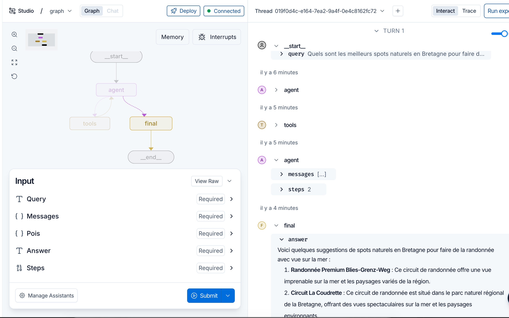

#  Examen Final  : Agent RAG - Tourisme  [Prof SARA RETAL]

## Présentation du Projet
L'objectif de ce travail était de développer un agent intelligent basé sur l'approche Agentic Retrieval-Augmented Generation (Agentic RAG), capable de répondre de manière pertinente à des questions complexes dans le domaine du tourisme en France métropolitaine.

La démarche adoptée s'est articulée autour de plusieurs étapes complémentaires. Elle a d'abord consisté à constituer une source documentaire fiable, puis à préparer et vectoriser les données afin de permettre une recherche sémantique efficace. Nous avons ensuite conçu et développé les différents outils (Tools) nécessaires au fonctionnement de l'agent, avant de mettre en œuvre son architecture de raisonnement à l'aide de LangGraph. Enfin, plusieurs phases d'optimisation du code, de tests et d'évaluation ont été réalisées afin d'améliorer les performances et la robustesse du système.

## Fonctionnement du Système

Le fonctionnement global de l'agent est résumé par les étapes suivantes :
- L'utilisateur saisit une question. 
- Le système vérifie qu'il s'agit bien d'une question touristique. 
- Le LLM analyse la requête. 
- Si une localisation est détectée, une recherche géographique est effectuée. 
- Une recherche sémantique est réalisée dans la base vectorielle Qdrant. 
- Les documents les plus pertinents sont récupérés. 
- Le LLM synthétise les informations. 
- Une réponse finale est retournée à l'utilisateur. 
L'utilisation de LangGraph permet de contrôler précisément les différentes étapes du raisonnement de l'agent.

## Résultats Obtenus

| Critère | Résultat |
|---|---|
| Détection des questions touristiques] | Très satisfaisante |
| Recherche sémantique | Très satisfaisante |
| Recherche géographique | Très pertinente |
| Génération des réponses | Cohérente |
| Temps moyen de réponse | 1 minute en moyenne  |

## Limites et axes d'amélioration 
### Limites 
- Certaines informations de DataTourisme sont incomplètes ; 
- Les réponses restent dépendantes de la qualité des documents indexés ; 
- La compréhension des requêtes très ambiguës peut encore être améliorée ; 
- La recherche géographique pourrait être plus fine pour certaines requêtes complexes.
- L’agent s’intéresse à des domaines autre que le tourisme

### Améliorations
- Élargir et Enrichir la base documentaire pour une couverture de la France métropolitaine d'autres sources touristiques (DOM-TOM, Guadeloupe, Martinique, Guyane, La Réunion, Mayotte); 
- Intégrer un agent spécialisé dans le calcul d'itinéraires touristiques ; 
- Générer des recommandations personnalisées selon le profil de l'utilisateur ; 
- Ajouter un routage conditionnel qui analyse la question de l’utilisateur; 
- Ajouter une interface web interactive permettant de visualiser les lieux sur une carte. 

## Simulation
